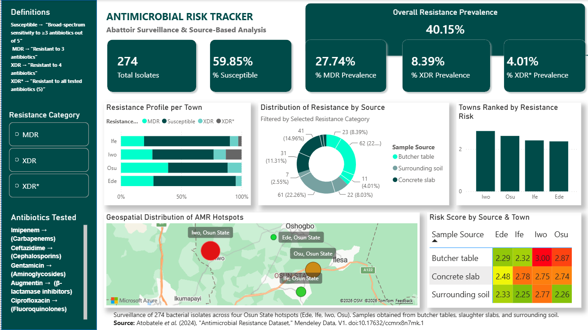
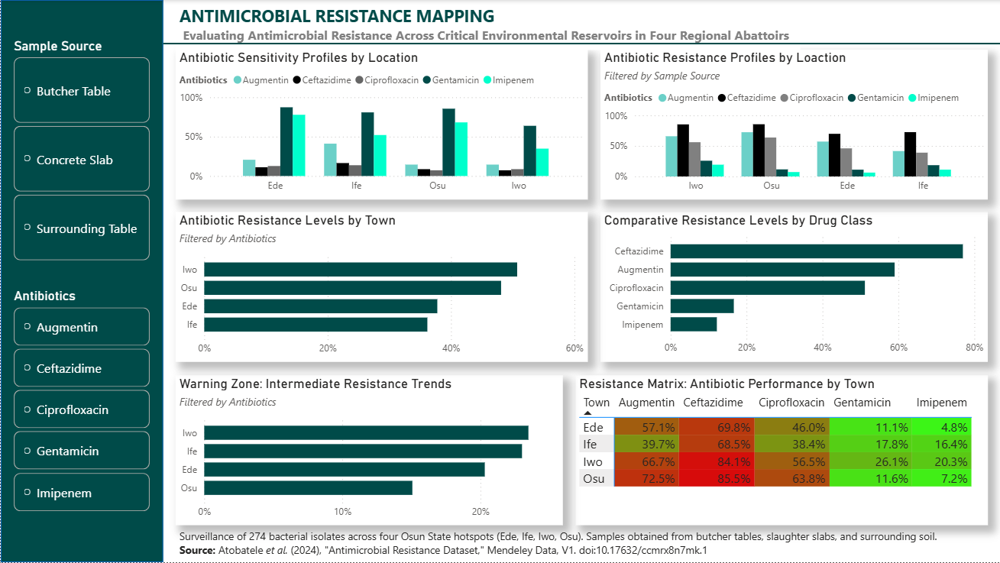
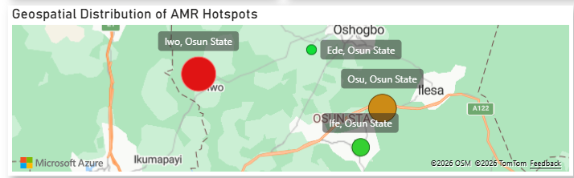
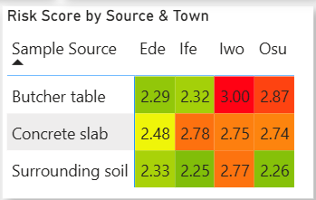
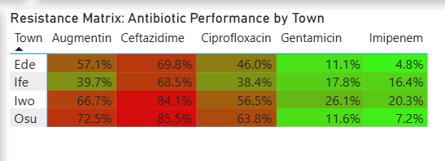

# 🦠 AMR Abattoir Analysis


Geospatial and data-driven analysis of antimicrobial resistance patterns in abattoir samples across Osun State, identifying resistance hotspots and public health risks. 

# 🦠 Geospatial Surveillance of Antimicrobial Resistance (AMR)
### Evaluating Pathogen Persistence Across Critical Abattoir Reservoirs in Osun State 

## 📑 Table of Contents

- [📌 Project Overview](#-project-overview)
- [🚨 Public Health Problem](#-public-health-problem)
- [🧠 Analytical Approach](#-analytical-approach)
- [🧪 Dataset & Structure](#-dataset--structure)
- [🧹 Data Cleaning & Feature Engineering](#-data-cleaning--feature-engineering)
- [📊 Key Insights](#-key-insights)
- [📊 Dashboard & Visual Insights](#-dashboard--visual-insights)
- [💡 Strategic Recommendations](#-strategic-recommendations)
- [⚠️ Limitations](#-limitations)
- [🛠️ Tech Stack](#️-tech-stack)
- [📂 Repository Contents](#-repository-contents)
- [👨‍🔬 About the Author](#-about-the-author) 

## 🌟 Project Highlights

- 🦠 **274 bacterial isolates** analyzed across four municipalities in Osun State.
- 📍 Identified **geographic antimicrobial resistance hotspots** using geospatial analysis.
- 🧪 Applied **CLSI standards** to classify isolates as Sensitive, Intermediate, or Resistant.
- ⚠️ Developed a custom **Environmental Danger Index** to assess contamination risk.
- 📈 Engineered **15+ analytical metrics** from raw laboratory data.
- 📊 Built an **interactive Power BI dashboard** to communicate key public health insights.
- 💡 Produced evidence-based recommendations to support antimicrobial stewardship and environmental health policies.

## 🎯 Project Objectives

This project was undertaken to:

- Assess the prevalence and distribution of antimicrobial resistance (AMR) in abattoir-derived bacterial isolates across Osun State.
- Identify geographic hotspots with elevated resistance patterns using geospatial analysis.
- Evaluate the effectiveness of commonly used antibiotics against isolated pathogens.
- Develop analytical metrics, including an Environmental Danger Index, to prioritize high-risk environmental reservoirs.
- Transform raw laboratory data into an interactive Power BI dashboard that supports evidence-based public health decision-making.
- Generate actionable recommendations for antimicrobial stewardship, environmental sanitation, and disease surveillance.

## 📌 Project Overview
Antimicrobial Resistance (AMR) is often called the "Silent Pandemic." This project utilizes geospatial mapping and data analytics to track the prevalence of resistant bacterial isolates across four key municipalities in Osun State: **Ede, Ife, Iwo, and Osu.**

By analyzing **274 bacterial isolates** from abattoir environments, this study identifies "Superbug" hotspots and high-risk environmental reservoirs, providing a data-driven roadmap for public health intervention.

## 🚨 Public Health Problem 
Abattoirs serve as critical points for pathogen transmission, yet monitoring of antimicrobial resistance in these environments is often limited.
The absence of structured surveillance makes it difficult to:

- Identify resistance hotspots
- Track environmental contamination
- Evaluate antibiotic effectiveness
  
This project addresses these gaps by transforming raw laboratory data into actionable public health insights.

## 🧠 Analytical Approach
The project followed a structured analytical workflow:
* Cleaned and transformed raw laboratory data
* Engineered new analytical features to enhance insight generation
* Designed a risk-based framework to quantify environmental danger
* Built an interactive dashboard to visualize resistance patterns
* Interpreted results to generate actionable recommendations

## 🧪 Dataset & Structure
* Source: Atobatele et al. (2024)
doi: 10.17632/ccmrx8n7mk.1 
* Size: 274 bacterial isolates
* Locations: Ede, Ife, Iwo, Osu
Variables: Antibiotics, Sample Source, Inhibition Zones

## 🧹 Data Cleaning & Feature Engineering 
The project transformed a raw dataset of 6 core columns into a sophisticated analytical framework featuring over **15 strategic metrics**, including:
- **CLSI Standardization:** Categorizing inhibition zone measurements (mm) into Sensitive, Intermediate, and Resistant.
- **Environmental Danger Index:** A custom-weighted "Risk Score" to quantify the danger level of specific surfaces.
- **Resistance Phenotyping:** Classifying isolates as **MDR** (Multi-Drug Resistant), **XDR** (Extensively Drug-Resistant), and **XDR*** (resistant to all five tested antibiotic classes).
    
## 📊 Key Insights
### 1. Geographic "Epicenters"
* **Iwo:** Ranked #1 in the Resistance Risk Index.
* **Osu:** Shows a staggering **85.5% resistance rate to Ceftazidime**, rendering the drug effectively useless in this municipality.


### 2. Environmental "Red Zones"
* **Butcher Tables:** Identified as the highest-risk surface (Risk Score: 3.00). Porous materials act as primary reservoirs for pathogen persistence.
* **Concrete Slabs:** Show high cumulative resistance to Augmentin, suggesting inadequate decontamination.
* **Surrounding Soil:** Acts as a "Warning Zone," with high resistance leakage into the broader community.


### 3. Antibiotic Performance
* **Highest Sensitivity:** **Imipenem** remains the most reliable option among the tested antibiotics (up to 80% sensitivity).
* **Highest Resistance:** **Ceftazidime** showed the highest resistance levels across the study locations, with resistance exceeding 68%.

## 📊 Dashboard & Visual Insights

### Executive Dashboard


### Antibiotic Resistance Analysis


### Geographic Hotspots


### Environmental Risk


### Antibiotic Performance



## 💡 Strategic Recommendations

1. **Infrastructure:** Replace porous wooden tables with stainless steel to prevent biofilm formation.
2. **Policy:** Restrict Ceftazidime use in local veterinary settings to slow resistance progression.
3. **Environmental:** Improve drainage systems to prevent effluent leakage into community soil.

## ⚠️ Limitations

* Dataset limited to selected abattoirs within Osun State
* Resistance patterns may vary across seasons and regions
* Findings should be complemented with broader surveillance data

## 🛠️ Tech Stack
- **Data Cleaning:** Microsoft Excel
- **Feature Engineering:** Power Query
- **Visualization:** Power BI (Geospatial Mapping & Interactive Reporting)
- **Domain Expertise:** Microbiology & Public Health Surveillance

## 📂 Repository Contents

```text
├── Dashboard/
│   └── Abattoir AMR.pbix
│
├── Data/
│   ├── Raw/
│   │   └── AMR raw dataset.xlsx
│   └── Processed/
│       ├── Abattoir AMR.xlsx
│       └── Abattoir_AMR_Antibiotics.xlsx
│
├── Images/
│   ├── executive_dashboard.png
│   ├── antibiotic_resistance_analysis.png
│   ├── geographic_hotspots.png
│   ├── environmental_and_source_risk.png
│   └── antibiotic_performance.png
│
├── Report/
│   └── Abattoir_AMR_Case_Summary.docx
│
└── README.md
```

---
## 👨‍🔬 About the Author
I am a **Microbiologist and Data Analyst**. I specialize in bridging the gap between laboratory science and strategic data reporting to drive data-informed health policies.

**Connect with me:**
https://www.linkedin.com/in/waliyullahi-akorede-husain-135131309/ | https://x.com/drwah001
